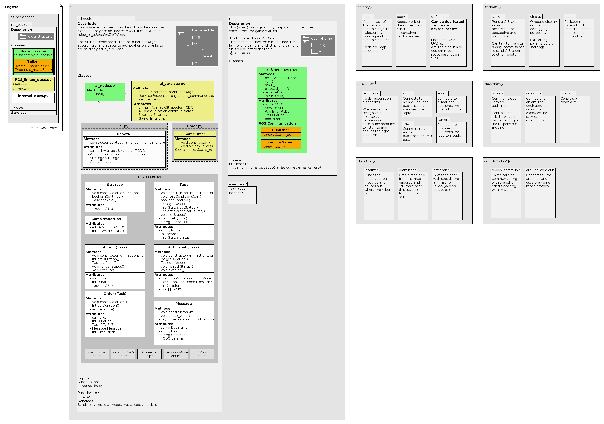

# Work in Progress

This is a General Purpose, Task-based full Robotics system based on ROS.

This project requires ROS Kinetic installed on the host machine. 
See [ROS Installation](http://wiki.ros.org/ROS/Installation) page for full details.
Each time you open a new terminal, you must source a workspace setup file by executing `source devel/setup.bash` or `source devel/setup.zsh` from the project's root folder.

In order to launch the entire system, run `roslaunch robot_ai_scheduler main.launch`.

The work is currently under development and is only at its **very early stage**.
- AI 80% done. Located in `src/robot_ai_scheduler/src`, launch it by running `rosrun robot_ai_scheduler ai_node.py`.
- Basic Map Mapaner done. Currently is capable of loading a JSON Describing a map, and rendering a map debug image as well as a collision map for the pathfinder node.
- Pathfinder package, with a python wrapper for ROS and a C++ engine (A-Star algorithm).

Project structure :

